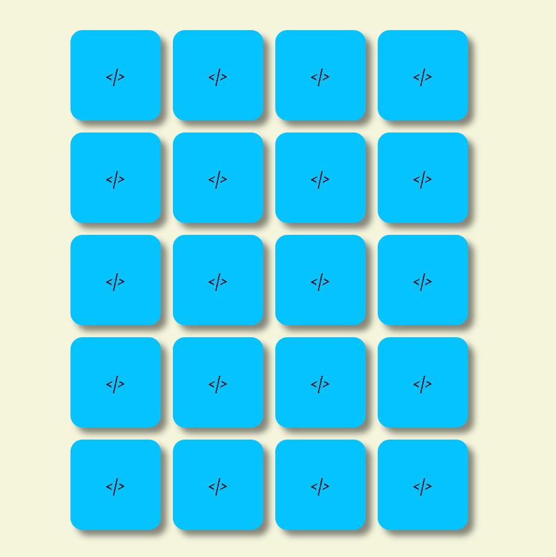
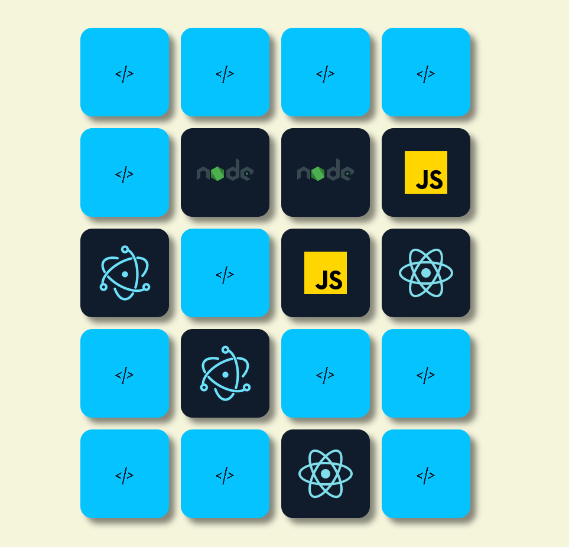
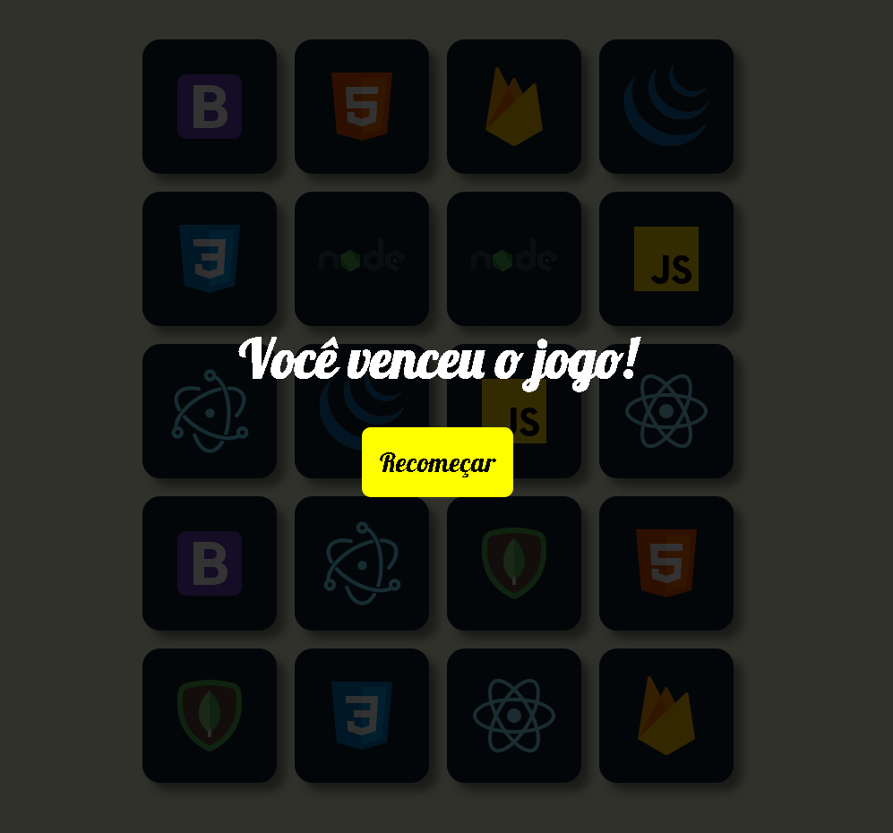

# **Jogo da Memória** [⬅️try it](#) !!

## 📖 **_Contexto da aula_**

Esse projeto foi feito durante os estudos no curso [_Desenvolvimento Full Stack_](https://programadorbr.com/) do professor e programador _Igor Oliveira_, no módulo de React!

---

## 🎯 **_Objetivos_**

Objeto da execução do projeto foi alem de aperfeiçoar o entendimento da biblioteca react e em conjunto a melhora do raciocínio lógico, conseguir transcrever um código em Html puro para React !!

---

## 🗓️ **_To Do:_**

_O projeto ainda não foi finalizado e existem algumas coisa a se fazer!!!_

-   [ ] Aumentar a responsividade;
-   [ ] Colocar um histórico de vitórias;

---

## 📓 **_Notas pessoais_**

-   Complexidade do projeto - ✔️✔️✔️❌❌
-   Nota pessoal - ❤️❤️⭕⭕⭕

---

## ☕ **_Tecnologias utilizadas_**

- [React](https://pt-br.reactjs.org/)

---

## 📸 **_Screenshots_**

<br>







---

## 🚀 **_Instalando e Rodando_** 

_Primeiro baixe o projeto da forma que mais lhe agradar!!_

_Dentro da pasta do projeto execute os seguintes comandos:_

```sh
npm install
```
_Logo depois:_

```sh
npm run dev
```
---